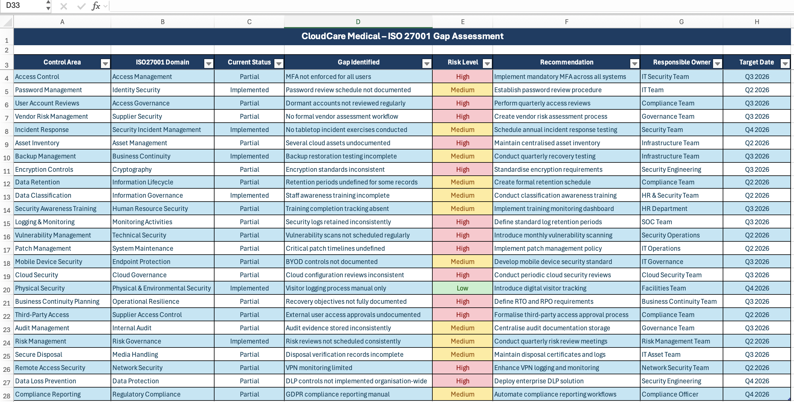
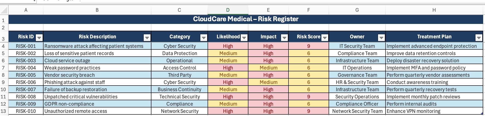
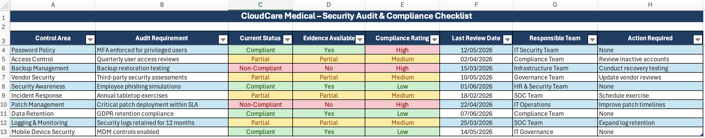
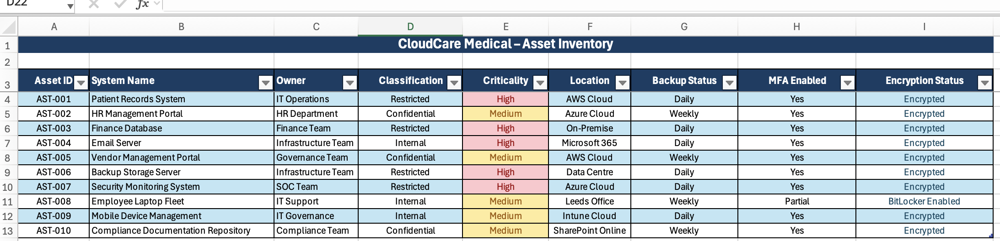
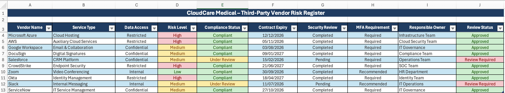

# CloudCare Medical – Governance, Risk & Compliance Portfolio

## Overview

This project demonstrates practical Governance, Risk & Compliance (GRC) activities aligned with ISO 27001 principles within a fictional healthcare organisation, CloudCare Medical.

The portfolio showcases practical documentation used by Governance, Risk, Compliance and Information Security teams to identify risks, monitor compliance, manage assets and respond to security incidents.

---
## Project Screenshots

### ISO 27001 Gap Assessment

### Risk Register

### Security Audit Checklist

### Asset Inventory

### Third-Party Vendor Risk Register

## Portfolio Documents

### Governance & Compliance

- ISO 27001 Gap Assessment
- Security Audit & Compliance Checklist
- Data Classification Policy
- Access Control Policy

### Risk Management

- Risk Register
- Risk Management Plan
- Third-Party Vendor Risk Register
- Vendor Risk Management Policy

### Incident Management

- Incident Response Tracker
- Incident Response Playbook

### Business Resilience

- Asset Inventory
- Business Continuity Plan
- Security Awareness Training Plan

---

## Skills Demonstrated

- ISO 27001 Awareness
- Information Security Governance
- Governance, Risk & Compliance
- Risk Assessment & Treatment
- Compliance Monitoring
- Vendor Risk Management
- Incident Management
- Business Continuity Planning
- Asset Management
- Security Documentation
- Microsoft Excel Reporting
- Technical Documentation

---

## Author

Alaa Abdelatif

Computer Science Graduate

Aspiring Governance, Risk & Compliance (GRC) Analyst

Currently studying ISC2 Certified in Cybersecurity (CC)
